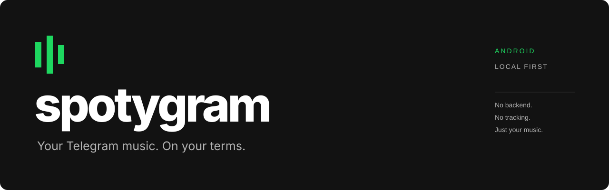
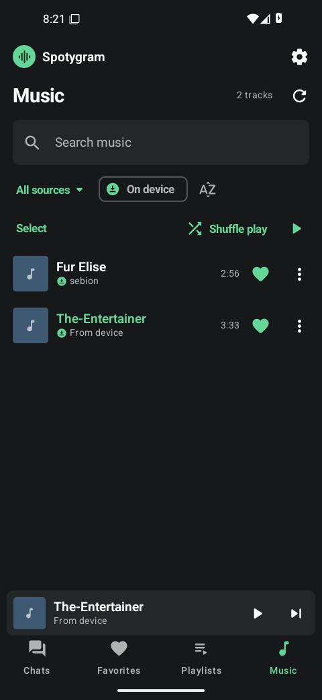
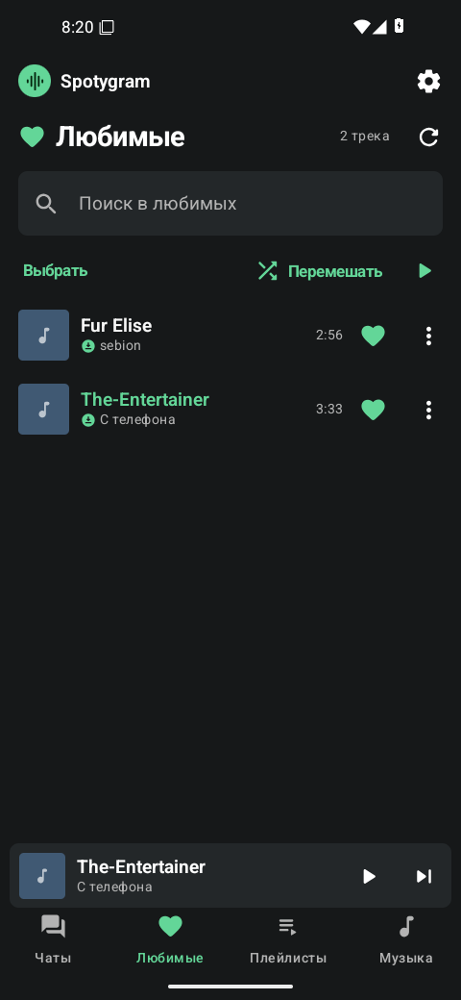
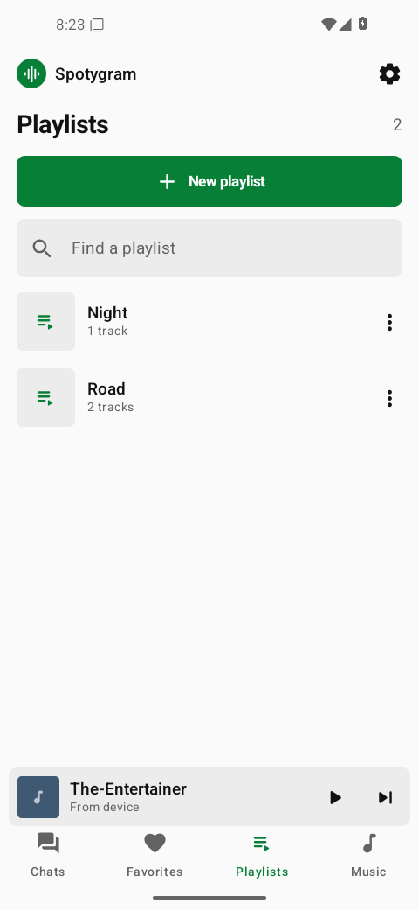
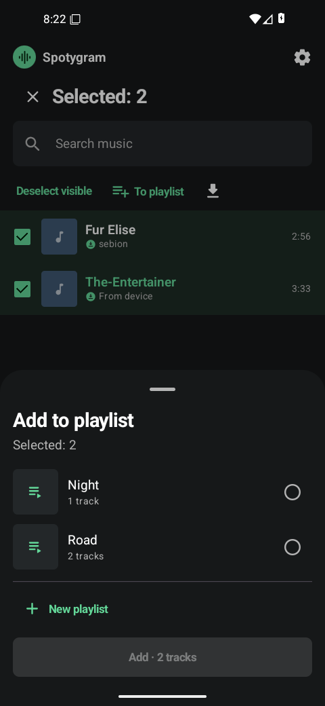
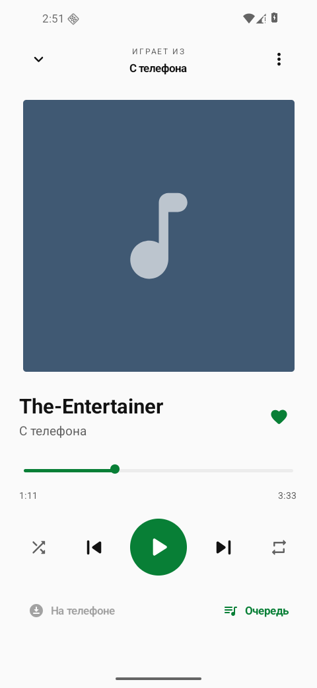
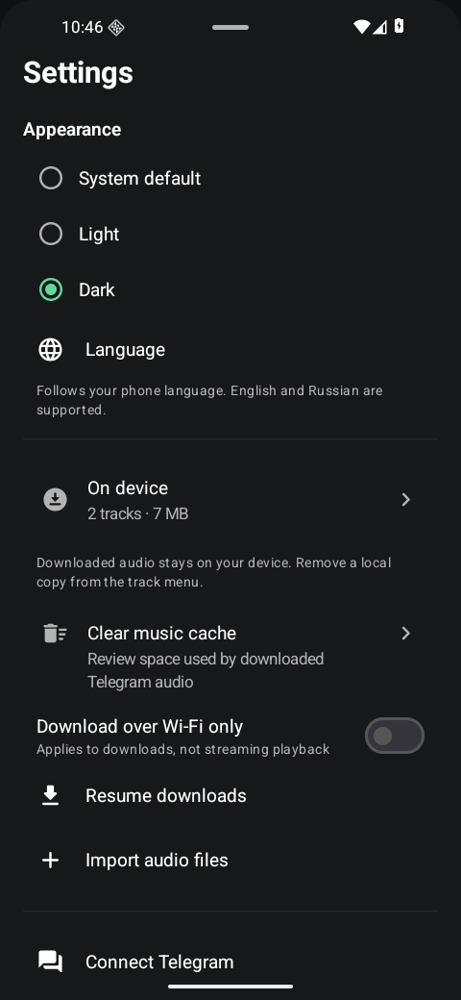

  
  
  
  

**A small, native music player for the audio files in your Telegram chats.**
Connect your account, choose your sources, and listen. Downloaded songs stay on your phone. No separate account, media server, subscription, or analytics.

> Private development repository. Source visibility stays private until the owner explicitly changes it.

<a href="https://github.com/Krablante/spotygram/releases">Download APK</a> · <a href="docs/usage.md">Как пользоваться</a> · <a href="docs/build.md">Build from source</a> · <a href="docs/architecture.md">Architecture</a>

## Made for listening

| Your library | Your player | Your phone |
| :--- | :--- | :--- |
| Selected chats and Saved Messages | Background playback and lock-screen controls | Offline audio, stored locally |
| Fast local search + explicit chat search | Queue, shuffle, repeat, favorites | Dark, light, and system themes |
| Playlists, multi-select and drag ordering | Seek without a second media cache | Audio import through Android's picker |

**Chats · Favorites · Playlists · Music.** Four direct destinations, with your last section restored on reopening. Tap a heart to save a favorite; hold a song to select it and add several tracks to a playlist together. Create a playlist with its songs in one screen, then drag its tracks into the order you want.

The player's order button cycles through **in order → shuffle without repeats → absolute random**. The dice mode independently draws each next entry, including possible immediate repeats, and continues until stopped. Its short listening history supports going back without growing the queue indefinitely. The player spreads its content over the available screen height, with scrolling when space is tight.

**Settings → Clear music cache** shows space used by Telegram audio and asks before removing local copies, including explicit offline downloads. Imported audio, favorites, playlists and sign-in remain. Playback/downloads stop for cleanup, and the result reports actual space freed.

See the [cache screen](docs/screenshots/cache-dark.png), captured with local imports excluded from its total.

**On device** shows each local file once, even when several Telegram messages reference it. Settings uses the same file collection for its count and size; active search/source filters can still narrow the visible list. Original message references are retained.

## A familiar place for your music

| Music · dark | Favorites · dark | Playlists · light |
| :---: | :---: | :---: |
|  |  |  |

| Select & create | Player · light | Settings |
| :---: | :---: | :---: |
|  |  |  |

Captured on Android. The recordings used during manual checks are not bundled with the app; sources and verification limits are documented in [the verification record](docs/verification.md).

The [Russian dark player](docs/screenshots/player-dark.png) shows absolute-random mode and the updated full-height layout on a taller phone-shaped viewport.

## Get started

1. Install the signed APK from **Releases**. Android may ask you to allow installation from the app opening the APK.
2. Connect your Telegram account and select chats containing music, or choose **«Пока без Telegram»** to import local audio.
3. Play a track. Once its file finishes downloading, the offline indicator appears. Use **«Скачать»** to save tracks or collections in advance.

The interface follows your phone language: **English and Russian**, with English as the fallback. On Android 13+, Settings → Language opens Android's per-app language selector. Android 8.0+. Choose the **ARM64 APK** for phones; a separate **x86-64 APK** is available for x86-64 Android environments. There is no 32-bit ARM build in this release.

## Deliberately small

One Android module. Kotlin and Compose for the interface, Media3 for playback, TDLib for Telegram, SQLite for the music index. No web runtime, localhost streaming proxy, Python in the APK, recommendation service, or custom audio decoder bundle.

TDLib and OpenSSL are built from pinned upstream sources. The release APK includes the app's Telegram API configuration; users do not need to obtain their own developer credentials. Account sessions and signing keys are never part of the repository.

## Know what is local

- Audio stays in app-private storage. Uninstalling the app removes it; an APK update signed with the same key preserves it.
- Telegram access is a full account session. Selecting chats controls this app's music index, not Telegram's session permissions.
- All accessible music history loads automatically in pages, with no per-chat track cap. Tracks appear as they are indexed; interrupted history resumes from its saved cursor. **«Поискать в выбранных чатах»** also pages through all server matches.
- No secret chats, voice-message library, YouTube downloader, or cross-device playlist sync.
- Source-specific limitations and actual verification results are recorded in [the release notes](docs/verification.md), not hidden behind a claim of universal compatibility.

## Development

See [build instructions](docs/build.md), [architecture](docs/architecture.md), and [third-party notices](docs/third-party.md). Verification is manual and log-based; no unit, integration, or smoke-test files are maintained in this project.

Spotygram is an unofficial application using the Telegram API. It is not affiliated with Telegram or Spotify. The code is MIT-licensed; dependencies retain their own licenses. A private alpha does not establish compliance for a later public app-store release.
