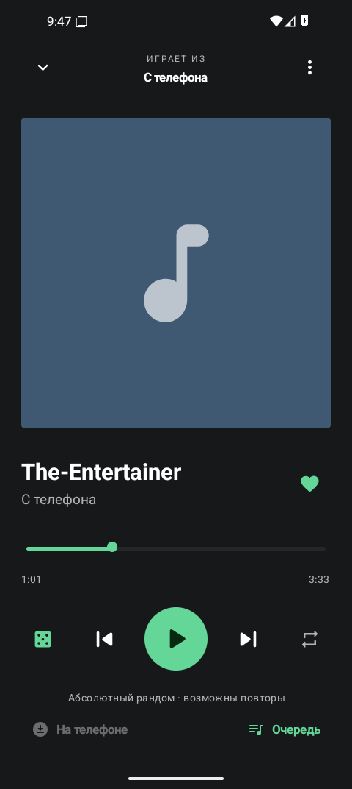

  <a href="README.md">English</a> · <strong>Русский</strong>

  

  <strong>Песни — в переписках. Слушать — здесь.</strong>

  <a href="https://github.com/Krablante/spotygram/releases/latest"><strong>Скачать APK</strong></a> ·
  <a href="docs/usage.md">Как пользоваться</a> ·
  <a href="docs/README.ru.md">Документация</a>

## Из переписки в музыкальную библиотеку

Песня в «Избранном», альбом в канале, несколько записей от друга. Файлы уже
в Telegram, но листать переписку ради следующей песни не хочется.

Spotygram — Android-плеер для этой коллекции. Выбираешь чаты, которые хочешь
слушать, и аудио из них появляется в общей библиотеке с поиском. Можно
сохранять любимые песни, собирать плейлисты и скачивать музыку на потом.
Файлы с телефона тоже подойдут: для них подключать Telegram вообще не нужно.

  
  &nbsp;
  
  &nbsp;
  

## Установить на телефон

Скачай **`spotygram-…-arm64.apk`** из [последнего релиза](https://github.com/Krablante/spotygram/releases/latest).
Нужны **Android 8.0 или новее** и устройство с 64-битным ARM-процессором.
Отдельный APK `x86_64` предназначен для Android на x86-64; сборки для 32-битного ARM нет.

Установи APK, войди в Telegram и открой **Чаты → Добавить чаты**. Выбери
«Избранное», группы или каналы с музыкой. Для готового APK не нужны
API-ключи разработчика. Если хочешь слушать только свои файлы, пропусти вход
и открой **Настройки → Добавить файлы с телефона**.

Следующие APK устанавливай поверх приложения, чтобы сохранить библиотеку.
Spotygram проверяет новые релизы при открытии, не чаще раза в сутки,
и молчит, пока обновления нет. Напоминание о конкретной версии можно закрыть,
автоматику — выключить, а проверку — запустить вручную в настройках.
Кнопка **Скачать и установить** есть и в предложении обновления, и в настройках:
она скачивает подходящий APK, проверяет его и открывает подтверждение Android.
Искать файл на GitHub не нужно. Без нажатия ничего не скачивается.

## Во время прослушивания

Музыка играет в фоне, управление доступно на экране блокировки. Нижняя
панель открывает полный плеер и очередь. Зажми песню, чтобы выбрать
несколько треков для плейлиста или скачивания; порядок в плейлисте
меняется перетаскиванием.

Кнопка порядка переключает **по порядку**, **перемешивание** и **абсолютный
рандом**. Перемешивание проходит подборку без повторов. Режим с кубиком
выбирает каждую следующую песню независимо: одна и та же может выпасть
дважды подряд. Он играет, пока не остановишь; кнопка «Назад» возвращает
к недавно прослушанным песням.

Не хочешь сохранять каждую песню? Включи **Не сохранять прослушанное**
в настройках. Плеер оставляет временный рабочий набор и удаляет более старые
копии. Старые файлы, явные скачивания и импорт сохраняются; кнопка
**Сохранить на устройстве** оставляет временную копию. По умолчанию режим
выключен. Временное место на диске всё равно нужно, а для возврата к старым
песням может потребоваться повторная загрузка.

Сохранённые песни доступны в разделе **На телефоне**. В интерфейсе есть
русский и английский языки, светлая, тёмная и системная темы.

Повторяющиеся записи скрываются по умолчанию. Выключи **Настройки → Скрывать
дубли**, чтобы снова видеть отдельные записи. Это меняет только списки,
ничего не удаляя.

## Твои файлы и аккаунт

Музыка, плейлисты и сессия Telegram хранятся на устройстве. У Spotygram нет
своего сервера, отдельной регистрации и аналитики. Приложение подключается
напрямую к Telegram; за обновлениями обращается к GitHub, которому видны
IP подключения и версия приложения.

Вход в Telegram создаёт **полноценную сессию аккаунта**. Выбор чатов ограничивает
музыкальную библиотеку Spotygram, а не права этой сессии. Её можно завершить
в разделе устройств официального Telegram.

**Очистка кэша удаляет и те песни Telegram, которые ты специально скачал.**
Импортированные файлы, любимые, плейлисты и вход сохраняются. Если исходное
сообщение больше недоступно, удалённую копию может не получиться восстановить.
Удаление самого Spotygram удаляет его локальную музыку и настройки;
облачной копии плейлистов нет.

## Под обложкой

Одно приложение на Kotlin/Compose, TDLib для Telegram, Media3 для
воспроизведения и SQLite для библиотеки. Без веб-вью и потокового прокси.
Плеер передаёт медиасессии Android не более трёх записей, а полную очередь
держит внутри приложения.

Подробности — в [устройстве приложения](docs/architecture.ru.md) и
[инструкции по сборке](docs/build.ru.md). Все руководства собраны
в [оглавлении документации](docs/README.ru.md).

Это ранний публичный выпуск. Секретные чаты, голосовые сообщения и
синхронизация плейлистов не поддерживаются. В [журнале проверок](docs/verification.md)
отделено проверенное поведение от непроверенных сценариев, в том числе
на физических устройствах и с авторизованным Telegram. На скриншотах —
настоящее приложение с демонстрационными записями, а не музыка из комплекта APK.

## Лицензия

[MIT](LICENSE). Зависимости сохраняют [свои лицензии](docs/third-party.md).
Spotygram — неофициальное приложение на Telegram API, не связанное
с Telegram или Spotify.
